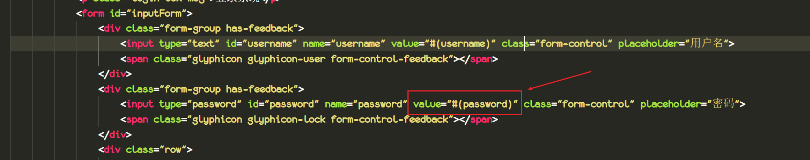
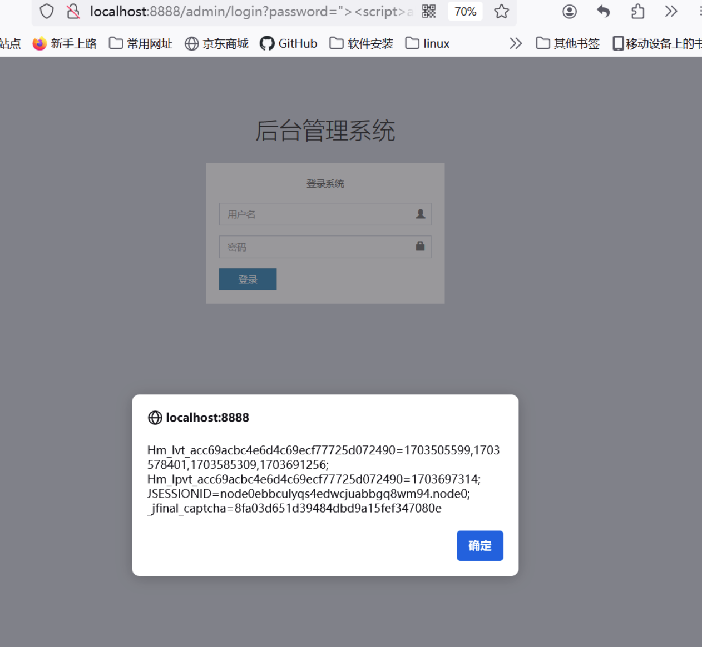

**target**:https://gitee.com/heyewei/JFinalcms

version: v5.0.0

A reflected XSS vulnerabilities were discovered in JFinalCms.  
A reflected XSS exists via the /admin/login password parameter, which allows remote attackers to inject arbitrary web script.#(password) this syntax allows a variable to be reserved in the form. After the user submits the form, this position will be replaced by the actual value entered by the user.

Poc:`">`,As shown in the figure below, the attack was successfully implemented.

