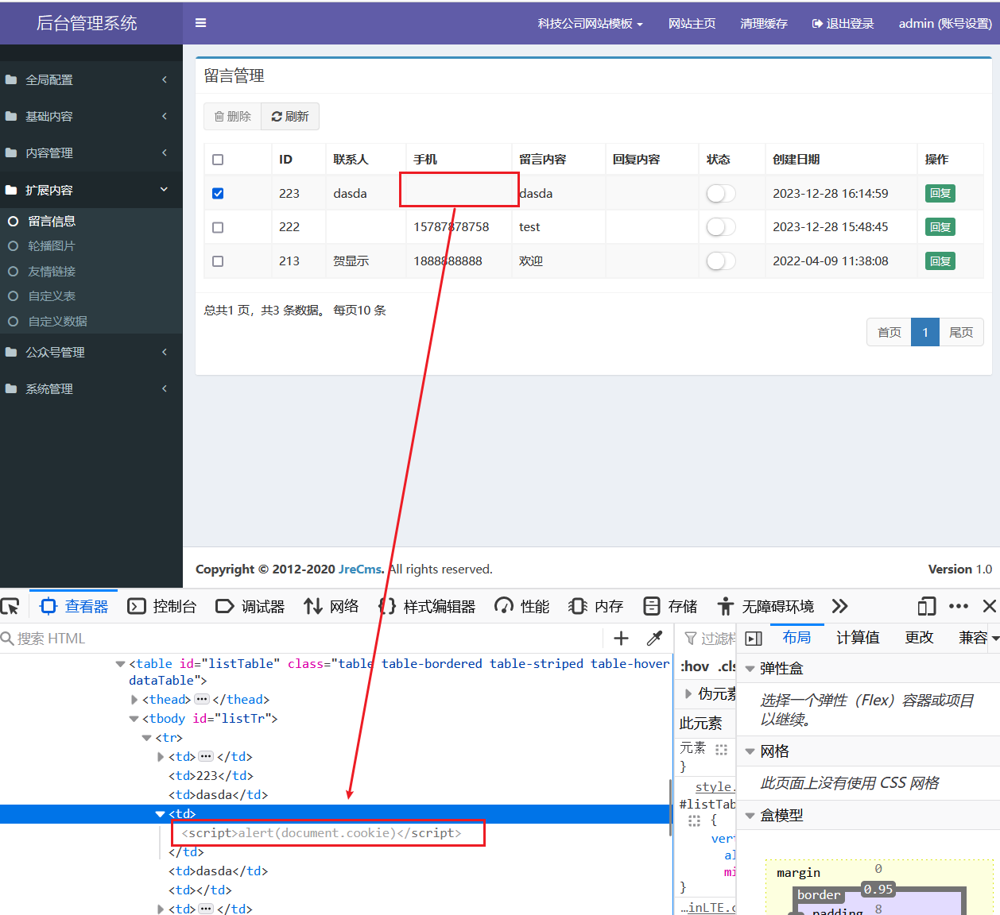

**target**:https://gitee.com/heyewei/JFinalcms

version: v5.0.0

A stored XSS exists in JFinalcms via the /gusetbook/save mobile parameter, which allows remote attackers to inject arbitrary web script or HTML.

Poc:``

When an administrator logs into the system and accesses the /admin/guestbook, he ought to be attacked:

Security risks arise from components /guestbook/save .The moblie field is not encoded or filtered properly, leading to a potential XSS vulnerability:

