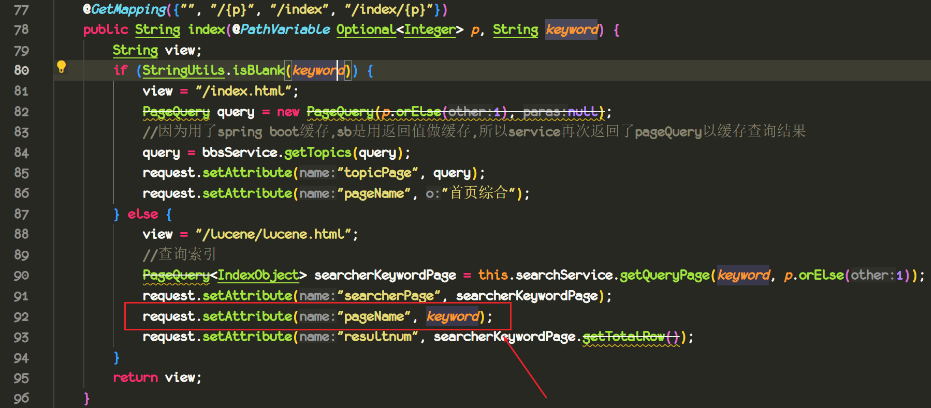
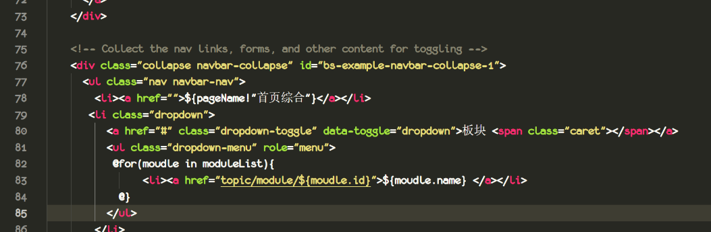
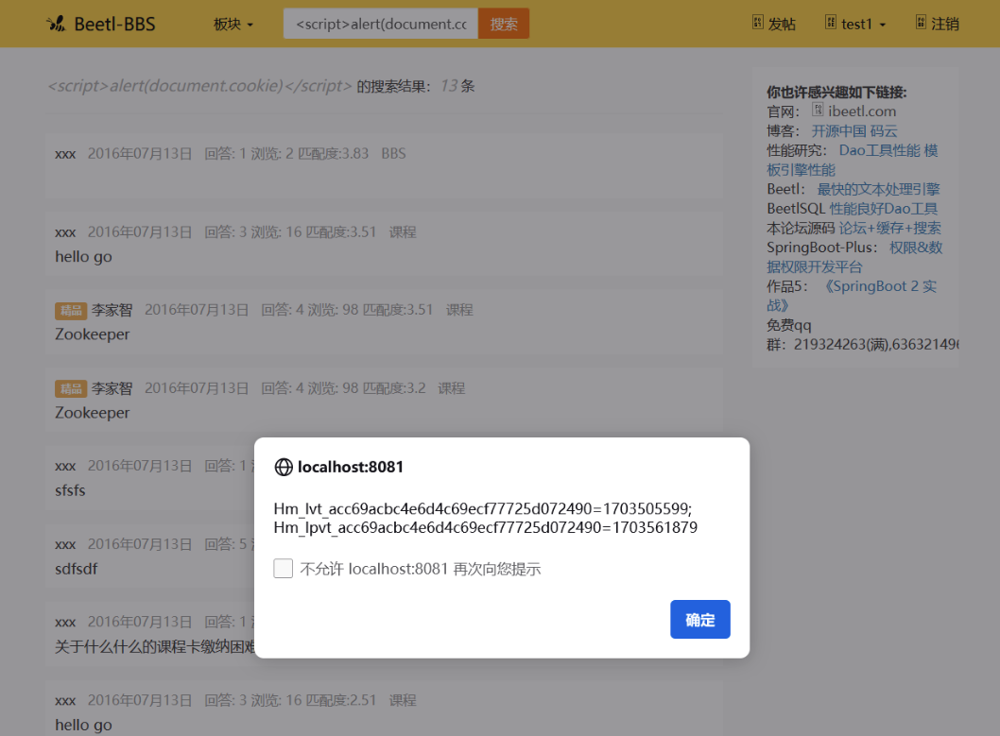
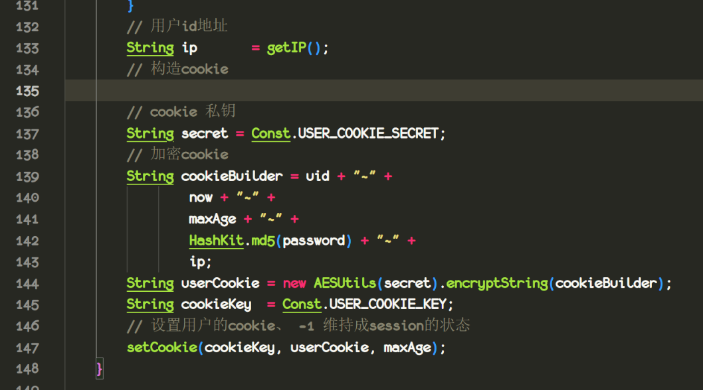

**target**:https://gitee.com/xiandafu/beetl-bbs  
**affected version:** v2.0 

A xss vulnerability was discovered in beetl-bbs.
A reflected XSS exists via the /index keyword parameter, which allows remote attackers to inject arbitrary web script or HTML.

Poc:``

Information Exposure: The cookie set after a successful user login contains an MD5 hash of the user's password. If the user cookie is leaked and the AES encryption key is not changed, an attacker can obtain the password hash and attempt to crack the actual password through hash collision attacks.

